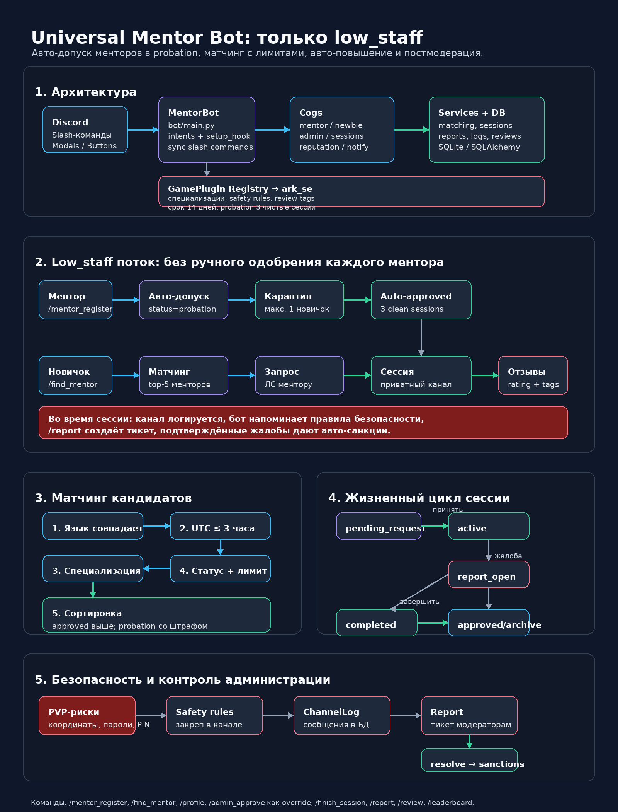

# Universal Mentor Bot

Универсальный Discord-бот для менторства в играх. Логика менторства не привязана к одной игре: конкретные игры подключаются плагинами. Первый встроенный плагин — `ark_se` для ARK: Survival Evolved.

## Возможности MVP

- `/mentor_register` — регистрация ментора сразу включает карантинный статус `probation`.
- `/find_mentor` — анкета новичка и автоматический подбор ментора.
- `/profile [@user]` — профиль ментора или новичка.
- `/admin_approve`, `/admin_reject`, `/admin_ban`, `/admin_unban` — ручное админское управление и override для спорных случаев.
- `/admin_stats`, `/admin_sessions`, `/admin_logs` — контроль и аналитика.
- `/finish_session`, `/extend_session`, `/report`, `/resolve_report` — управление сессиями и жалобами.
- `/review` и `/leaderboard` — отзывы, рейтинг и лидерборд.
- Приватные каналы менторства, архивирование, логирование сообщений, напоминания безопасности.
- Единственный режим работы — `low_staff`: авто-допуск менторов в карантин, матчинг с ограничением, авто-повышение и авто-санкции по подтверждённым жалобам.
- SQLite по умолчанию, SQLAlchemy async для будущего PostgreSQL.
- Docker/Docker Compose для VPS-деплоя.

## Режим low_staff

`low_staff` — единственный сценарий работы для серверов, где мало администраторов и модераторов.

- Новый ментор после `/mentor_register` получает статус `probation` и может сразу участвовать в подборе.
- Карантинный ментор ограничен 1 активным новичком независимо от заявленного лимита.
- После 3 завершённых сессий без открытых жалоб бот автоматически переводит ментора в `approved`.
- Подтверждённые жалобы автоматически понижают approved-ментора обратно в `probation`; после 3 подтверждённых жалоб ментор получает `banned`.

## Плагинная архитектура

Игровые отличия описываются в `bot/plugins/<game>/plugin.py` через `GamePlugin`:

- название игры;
- подписи игровых ников;
- список специализаций;
- правила безопасности;
- теги отзывов;
- длительность сессии и карантин нового ментора.

Чтобы добавить игру, создайте новый модуль плагина, зарегистрируйте его в `bot/plugins/__init__.py` и укажите `GAME_PLUGIN=<key>` в `.env`.

## Визуализация работы бота



Подробные Mermaid-диаграммы: [`docs/mentor_bot_visualization.md`](docs/mentor_bot_visualization.md). SVG-версия схемы: [`docs/mentor_bot_workflow.svg`](docs/mentor_bot_workflow.svg).

## Быстрый старт

```bash
python -m venv .venv
source .venv/bin/activate
pip install -r requirements.txt
cp .env.example .env
# заполните DISCORD_TOKEN и при желании DISCORD_GUILD_ID
python -m bot.main
```

## Discord permissions

Включите intents в Discord Developer Portal:

- Server Members Intent;
- Message Content Intent.

Права бота на сервере:

- Manage Channels;
- Manage Roles;
- Send Messages;
- Embed Links;
- Read Message History;
- Use Application Commands.

## Docker

```bash
cp .env.example .env
# заполните .env
docker compose up -d --build
```

## Ключи специализаций ARK SE

Для MVP формы принимают ключи через запятую:

- `base_building` — базостроение;
- `taming` — приручение;
- `pvp` — PvP;
- `farming` — фарм и экономика;
- `navigation` — навигация и выживание;
- `general` — общее менторство.

## Тесты и линт

```bash
ruff check .
pytest
```
