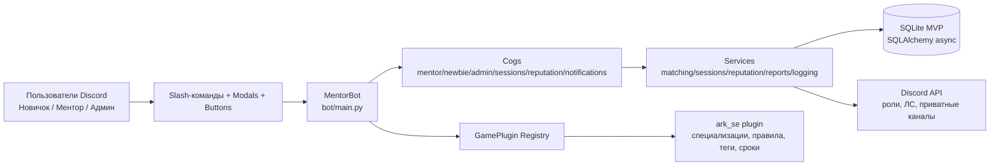
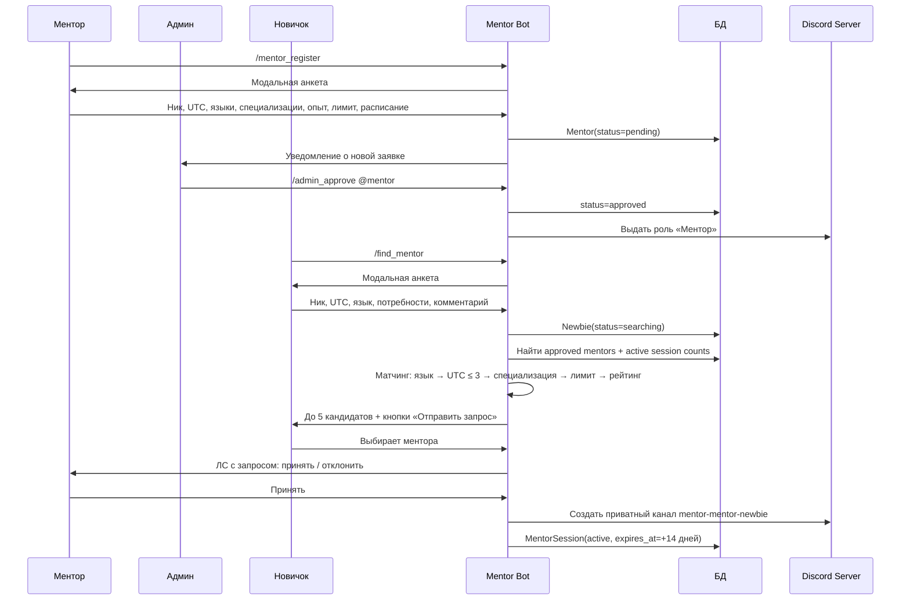
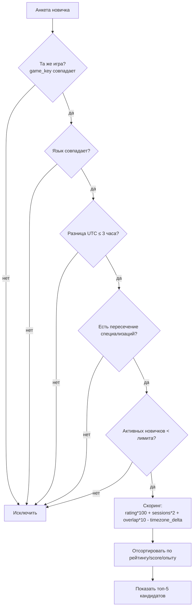
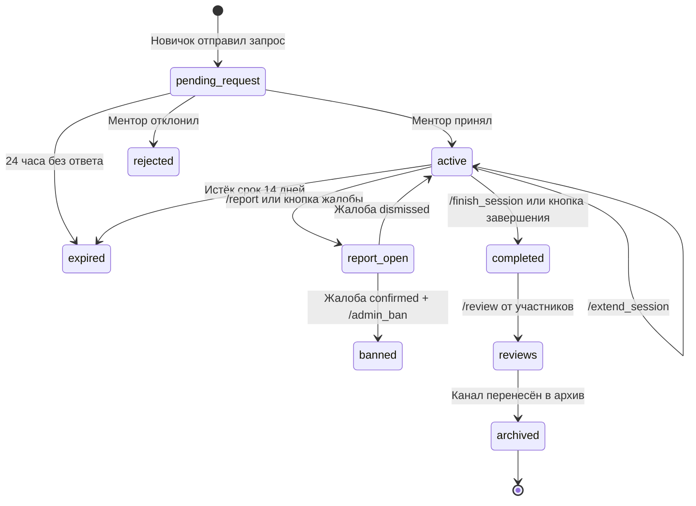

# Как работает Universal Mentor Bot

## 1. Общая архитектура



## 2. Основной пользовательский поток



## 3. Алгоритм матчинга



## 4. Жизненный цикл сессии



## 5. Безопасность PVP-сервера

```mermaid
flowchart LR
    A[Только approved менторы] --> B[Приватный канал]
    B --> C[Логирование сообщений\nChannelLog]
    C --> D[Модераторские команды\n/admin_logs /admin_sessions]
    B --> E[Напоминания безопасности\nкаждые 3 дня]
    B --> F[Кнопка /report]
    F --> R[Report(open)]
    R --> M[Модератор решает]
    M --> OK[Dismiss / Resolve]
    M --> BAN[/admin_ban\nстатус banned + снять роль]
```

## 6. Что делает плагин ARK SE

Плагин `ark_se` добавляет игровые правила без изменения ядра бота:

- игровые подписи: «Игровой ник в ARK»;
- специализации: базостроение, приручение, PvP, фарм, навигация, общее менторство;
- PVP safety rules: не передавать координаты базы, пароли, PIN-коды, доступ к хранилищам;
- теги отзывов для ментора и новичка;
- дефолтный срок сессии: 14 дней;
- карантин нового ментора: 3 первые сессии.

## 7. Команды по ролям

| Роль | Основные команды |
|---|---|
| Новичок | `/find_mentor`, `/profile`, `/report`, `/review` |
| Ментор | `/mentor_register`, `/profile`, `/finish_session`, `/extend_session`, `/review` |
| Админ | `/admin_approve`, `/admin_reject`, `/admin_ban`, `/admin_unban`, `/admin_settings`, `/admin_stats` |
| Модератор | `/admin_sessions`, `/admin_logs`, `/resolve_report` |
